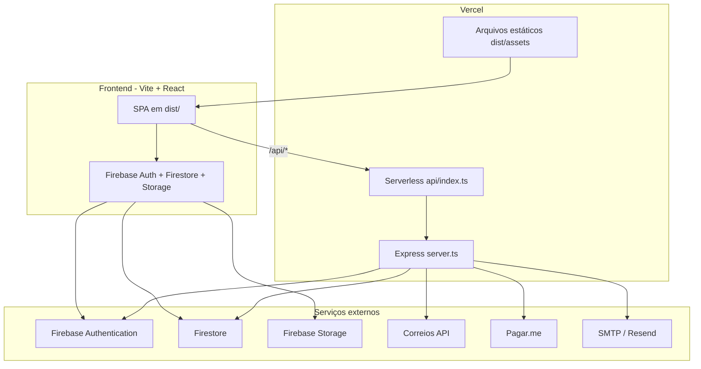

# Gestão de Assistências

Plataforma web para gestão de ordens de serviço, orçamentos, RAT, clientes, relatórios e integrações (Firebase, Correios, Pagar.me, e-mail).

Repositório: [github.com/RonaldRrolv22/gestao-de-assistencia](https://github.com/RonaldRrolv22/gestao-de-assistencia)

## Arquitetura (Vercel)



| Camada | Tecnologia | Função |
|--------|------------|--------|
| Frontend | React 19, Vite, Tailwind | UI, Kanban, modais, login |
| API | Express em `server.ts` | PDF, e-mail, etiquetas, pagamentos, admin |
| Entry Vercel | `api/index.ts` | Monta o Express como função serverless |
| Dados | Firebase Auth + Firestore | Usuários, O.S., clientes, catálogos |
| PDF | Puppeteer + `@sparticuz/chromium` | Geração de PDF na Vercel |

### Rotas principais da API

| Rota | Descrição |
|------|-----------|
| `POST /api/shipping/generate-labels` | Etiqueta Correios + código de rastreio |
| `POST /api/email/tracking` | Reenvio de e-mail de rastreio |
| `POST /api/admin/users` | Criação de usuários (Admin SDK) |
| `PATCH /api/admin/users/:uid` | Edição de usuários |
| `POST /api/pagarme/*` | Pagamentos PIX/cartão |
| `POST /api/export-pdf` | Exportação PDF |

## Desenvolvimento local

```bash
cp .env.example .env
# Preencha .env e coloque firebase-service-account.json na raiz (não commitar)

npm install
npm run dev
```

O comando `npm run dev` sobe Express + Vite integrados (porta padrão **3000**).

## Deploy na Vercel

1. Importe o repositório GitHub na [Vercel](https://vercel.com).
2. Framework Preset: **Other** (já configurado via `vercel.json`).
3. Configure **todas** as variáveis de `.env.example` em **Settings → Environment Variables**.
4. **Importante na Vercel** (sem arquivos locais):
   - `FIREBASE_SERVICE_ACCOUNT` = JSON completo da service account **ou** base64 do JSON
   - `GOOGLE_SERVICE_ACCOUNT` = idem (se usar sync de catálogo)
   - `APP_URL` = URL de produção (`https://seu-projeto.vercel.app`)
5. Deploy.

### Firebase Console (pós-deploy)

- **Authentication → Settings → Authorized domains**: adicione `*.vercel.app` e seu domínio customizado.
- **Firestore / Storage rules**: deploy com `firebase deploy --only firestore:rules,storage` (requer Firebase CLI).
- **Authentication → Sign-in method**: E-mail/senha habilitado.

### Webhook Pagar.me

Configure na dashboard: `https://SEU-DOMINIO.vercel.app/api/pagarme/webhook`

## Segurança — o que NÃO vai para o Git

O `.gitignore` bloqueia:

- `.env` e variantes
- `firebase-service-account.json`, `google-service-account.json`
- Chaves `*.pem`, `*.key`, `credentials.json`

**Nunca** commite service accounts, senhas SMTP, tokens Correios/Pagar.me ou `HUB_TESTES_URL` com token real.

As variáveis `VITE_FIREBASE_*` são públicas no bundle (padrão Firebase Web SDK). Proteja com **domínios autorizados** e **Firestore Security Rules**.

## Scripts úteis

| Comando | Uso |
|---------|-----|
| `npm run dev` | Desenvolvimento |
| `npm run build` | Build produção (Vite + server) |
| `npm run lint` | Verificação TypeScript |
| `npm run seed` | Seed Firestore (local, com credenciais admin) |
| `npm run sync-users` | Sincroniza Auth → Firestore |

## Estrutura do projeto

```
api/index.ts          → Handler Vercel
server.ts             → Express (API + static em produção)
src/                  → Frontend React
src/lib/              → Correios, PDF, e-mail, Firebase Admin helpers
src/services/         → Clientes API e Firestore
firestore.rules       → Regras Firestore
storage.rules         → Regras Storage
vercel.json           → Configuração deploy
.env.example          → Template de variáveis (sem segredos)
```

## Licença

Apache-2.0 (ver cabeçalhos nos arquivos fonte).
